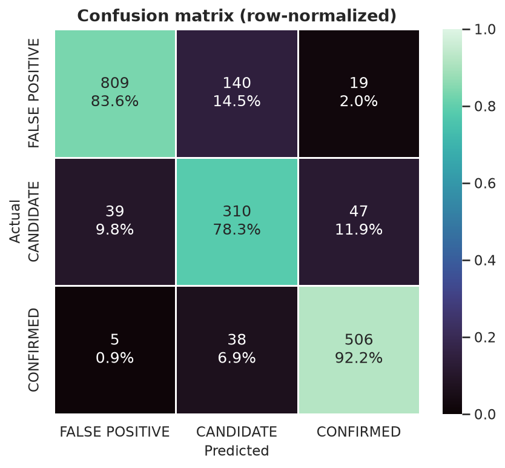
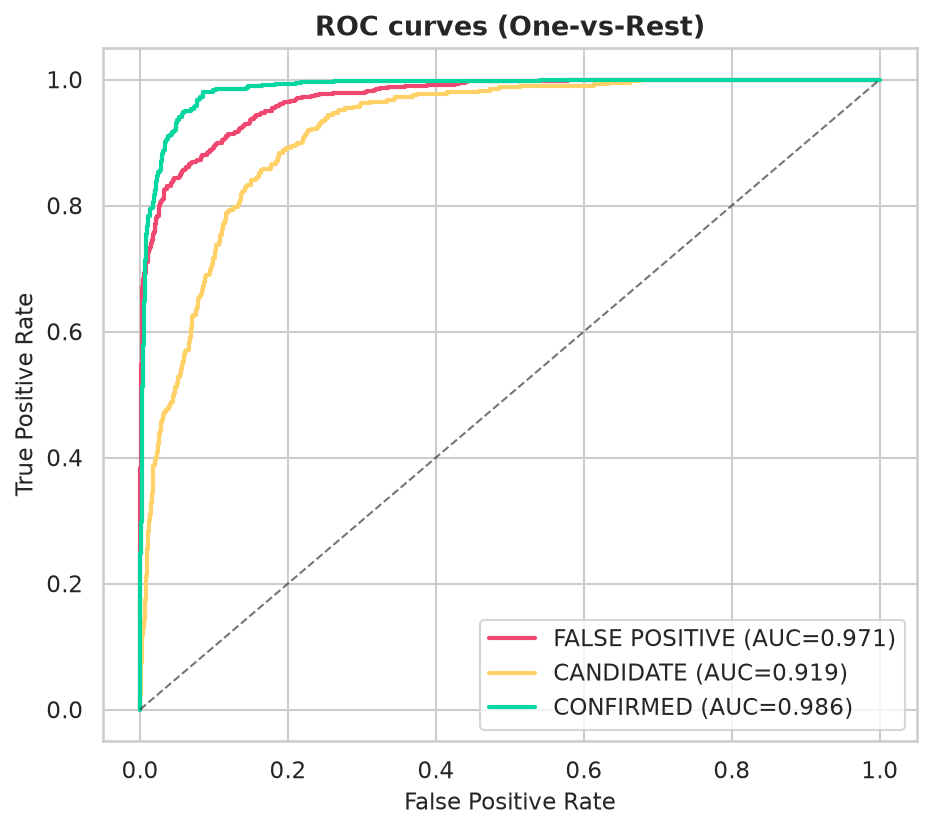
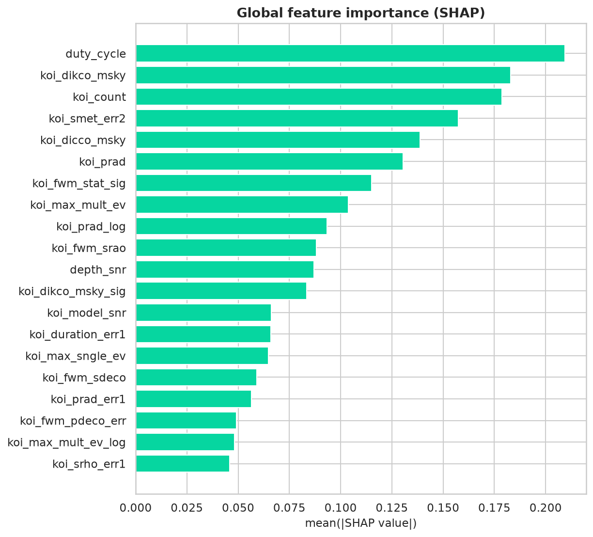
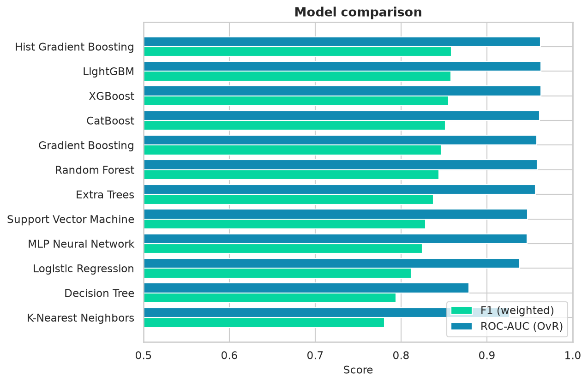

<div align="center">

# 🪐 Exoplanet Classifier

**Is that tiny flicker of starlight a real planet - or just noise?**
This project trains a machine-learning model to tell the difference, using real NASA Kepler data, and without cheating.

[](https://github.com/adhrit1010/Exoplanet-Classifier/actions)


</div>

---

## 🌍 What is this?

When NASA's *Kepler* telescope watched a star dim for a moment, it logged a **Kepler Object of Interest (KOI)** - a possible planet passing in front of it. Astronomers then sorted each one into three buckets:

| Label | Meaning |
|---|---|
| **CONFIRMED** | Yes - it's a real planet. |
| **CANDIDATE** | Maybe - still being checked. |
| **FALSE POSITIVE** | No - it's something else (two stars eclipsing, a glitch, a background object). |

Doing that by hand is slow and a little subjective. So I built a model that makes the call automatically from the actual measurements - and, just as importantly, **explains why** it decided what it did.

## ✨ The idea I'm most proud of: no cheating

Some columns in this dataset basically **give away the answer** - they're the conclusions NASA's own vetting pipeline already reached. Using them makes your score look amazing… but it isn't real learning, it's copying. A model like that would be useless on a brand-new, un-checked signal.

So I **throw those "answer-key" columns away inside the model itself**, where they can't sneak back in. The model has to reason from real physics instead: the shape of the dip in starlight, whether the star wobbles, where the light is actually coming from. There's even a test that *fails* if a single forbidden column slips through.

And I measured exactly what that honesty costs: using the answer-key columns would boost the score by about **+0.09 F1**. I left that on the table on purpose. 🙂

## 📊 How well does it do?

<!-- RESULTS:START -->
**Best model: Hist Gradient Boosting** · imbalance strategy: `class_weight` · 91 features · trained on 7,651 / tested on 1,913.

| Metric | Test score |
|---|---|
| Accuracy | 0.849 |
| Precision (weighted) | 0.865 |
| Recall (weighted) | 0.849 |
| **F1 (weighted)** | **0.854** |
| ROC-AUC (OvR, weighted) | 0.964 |
<!-- RESULTS:END -->

I framed the problem three ways - all **leakage-free**:

| What it predicts | Train F1 | Test F1 | Note |
|---|---|---|---|
| 3 classes (main model) | 0.89 | 0.85 | the honest, full problem |
| **Real planet vs. false signal** | **0.95** | **0.90** | both above 0.90 · matches the challenge's exact wording |
| **Confirmed planet vs. false positive** | **0.99** | **0.96** | both above 0.95 |

> The two binary framings clear **0.90 on both train and test**. The 3-class model
> sits at 0.85 because the **CANDIDATE** class is genuinely undecided (a planet that
> just hasn't been confirmed yet) - no model can push that above ~0.86 without using
> the "answer-key" columns we deliberately dropped.

📄 **Required write-up:** [`Written_Explanation.pdf`](outputs/reports/Written_Explanation.pdf) - the 500-1000 word explanation (EDA & cleaning, model choice, key findings, and a plain-English walkthrough of the predictions).

The deeper technical write-up - per-class scores, the leakage measurement, and the bonus models - is in [`outputs/reports/executive_report.md`](outputs/reports/executive_report.md) and [`outputs/reports/bonus_analysis.md`](outputs/reports/bonus_analysis.md).

## 🖼️ A few visualisations

**Confusion matrix** - where it gets things right and wrong. Most mistakes are CANDIDATE ↔ CONFIRMED, which makes sense (a candidate is just a planet that isn't confirmed *yet*):



**ROC curves** (one per class) - how cleanly each class is separated. False positives are caught very reliably:



**What the model pays attention to** (SHAP) - the measurements that matter most, like the signal strength, the centroid offset, and the planet's size:



**The 12 models I compared** (cross-validated) - gradient-boosted trees came out on top:



More charts - per-class SHAP, precision-recall, learning/validation/calibration curves, and the binary & validation confusion matrices - are in [`outputs/plots/`](outputs/plots).

## 🛠️ How it works, in plain terms

1. **Explore** the data - what's there, what's missing, how lopsided the classes are.
2. **Clean** it - drop the answer-key and useless columns, fill in gaps, and remove near-duplicate features.
3. **Add a few physics-inspired features** - e.g. how long the dip lasts compared to the orbit, or how strong the signal is relative to its noise.
4. **Compare ~12 models**, pick the best with cross-validation, and tune it with **Optuna** - tuned to *generalize*, not just memorize the training set.
5. **Explain every prediction** with **SHAP**, so you can see which measurements pushed it toward "planet" or "false positive."

## 🚀 Try it yourself

```bash
git clone https://github.com/adhrit1010/Exoplanet-Classifier.git
cd Exoplanet-Classifier

python -m venv .venv
# Windows:      .venv\Scripts\activate
# macOS/Linux:  source .venv/bin/activate

pip install -r requirements.txt     # just to run the app
```

**Launch the interactive dashboard** (the easiest way to play with it):
```bash
streamlit run app/streamlit_app.py
```
Explore the data, then type in a signal's properties and watch it predict - with a confidence score and a SHAP explanation.

**Other things you can do:**
```bash
pip install -r requirements-dev.txt          # extra tools for training
python -m src.train                          # retrain the whole pipeline
python -m src.predict --input data/new_kois.csv --output scored.csv
jupyter notebook notebooks/01_exoplanet_classifier.ipynb   # the full story, step by step
```
> The trained models are included in the repo, so the dashboard works right after `requirements.txt` - no retraining needed.

## 🗂️ What's in here

```
data/        the NASA KOI dataset
notebooks/   the full walkthrough notebook
src/         the actual code (cleaning, features, training, explaining, predicting)
app/         the Streamlit dashboard
models/      the trained models
outputs/     plots, reports, and predictions
tests/       checks that no "answer-key" column ever leaks in
```

## 🔭 What I'd add next

- Bring in newer **TESS** mission data to test it on a different telescope.
- Calibrate the probabilities so the confidence scores are even more trustworthy.
- An "active learning" loop that flags the most uncertain signals for a human to double-check.

## 📄 License & author

Released under the [MIT License](LICENSE).
Built by **Adhrit Chakraborty** for the Celesta Exoplanet Challenge - with a focus on doing it *honestly*: no leakage, reproducible results, and predictions you can actually explain.
